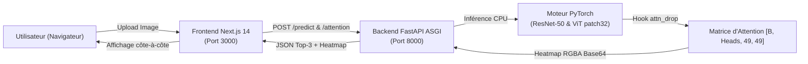

  

# 🗺️ ARCHITECTURE & GUIDE COMPLET DU CODEBASE

## Projet : Vision Transformer vs CNN (ResNet-50) — Classification Fine-Grained sur CUB-200-2011

> **Master 1 IA & Big Data**
>
> - **Rôle A (Data & Experiments) :** SONHOUIN Abdoul-raouf
> - **Rôle B (Model & Research) :** NGARTOBAYE OUMAROU BILLY
> - **Rôle C (Reporting & Backend/Fullstack) :** YEYE Koffi Gagnon

---

## 🧭 Sommaire du Guide

1. [Vue d&#39;Ensemble &amp; Arborescence Globale](#1-vue-densemble--arborescence-globale)
2. [Module Données (`/src/data` &amp; `/data`) — Rôle A](#2-module-données-srcdata--data--rôle-a)
3. [Module Modélisation (`/src/models`) — Rôle B](#3-module-modélisation-srcmodels--rôle-b)
4. [Module Entraînement &amp; Expérimentations (`/src/train`) — Rôle B](#4-module-entraînement--expérimentations-srctrain--rôle-b)
5. [Module Évaluation &amp; MLflow (`/src` &amp; `/results`) — Rôle B](#5-module-évaluation--mlflow-src--results--rôle-b)
6. [Module Application Web &amp; Déploiement (`/app` &amp; Docker) — Rôle C](#6-module-application-web--déploiement-app--docker--rôle-c)
7. [Module Restitution Scientifique (`/report` &amp; Slides) — Rôle C](#7-module-restitution-scientifique-report--slides--rôle-c)
8. [Flux de Données End-to-End (Data-Flow)](#8-flux-de-données-end-to-end-data-flow)
9. [Guide de Démarrage &amp; Commandes Clés](#9-guide-de-démarrage--commandes-clés)

---

## 1. Vue d'Ensemble & Arborescence Globale

```
vit-vs-cnn-fine-grained/
│
├── 📂 app/                          # APPLICATION WEB FULLSTACK (Rôle C)
│   ├── 📂 backend/                  # API REST FastAPI (Inférence & Attention)
│   │   ├── main.py                  # Point d'entrée serveur Uvicorn, cycle de vie Lifespan
│   │   ├── routers/                 # Routes HTTP (/predict, /attention, /classes, /health)
│   │   │   ├── predict.py           # Inférence parallèle ResNet-50 & ViT
│   │   │   ├── attention.py         # Hook PyTorch & extraction de Heatmap
│   │   │   └── health.py            # Endpoint de santé pour Docker healthcheck
│   │   ├── utils/                   # Utilitaires de conversion d'image et mapping classes
│   │   └── Dockerfile               # Image Python 3.11-slim optimisée CPU
│   └── 📂 frontend/                 # Interface Utilisateur Next.js 14 / React 18
│       ├── 📂 src/                  # Composants React, hooks, pages
│       │   ├── components/          # Dropzone, Comparateur côte-à-côte, Heatmap overlay
│       │   └── pages/               # Page principale de démo
│       └── Dockerfile               # Build multi-stage Node 20 Alpine standalone
│
├── 📂 data/                         # DONNÉES CUB-200-2011 (Rôle A)
│   ├── 📂 CUB_200_2011/             # Dataset brut (images/, classes.txt, image_class_labels.txt)
│   └── 📂 data_processed/           # Données préparées, métadonnées et figures EDA
│       ├── metadata.csv             # Tableau 11 788 images (chemin, classe, split)
│       └── 📂 figures/              # Figures générées (eda_similar_classes.png, etc.)
│
├── 📂 src/                          # MOTEUR SCIENTIFIQUE & MODÉLISATION
│   ├── 📂 data/                     # Pipeline données PyTorch (Rôle A)
│   │   ├── cub_dataset.py           # Dataset PyTorch personnalisé pour CUB-200
│   │   ├── splits.py                # Découpage stratifié (10%, 25%, 50%, 100%, Val, Test)
│   │   ├── transforms.py            # Augmentations PyTorch (faible et forte)
│   │   └── dataloader.py            # Générateur de DataLoaders avec workers
│   │
│   ├── 📂 models/                   # Architectures neuronales (Rôle B)
│   │   ├── resnet50.py              # CNN ResNet-50 adapté torchvision (23.9M params)
│   │   ├── vit_pretrained.py        # ViT pré-entraîné timm (Small patch 16 et 32)
│   │   ├── vit_scratch.py           # ViT custom codé from scratch (11.1M params)
│   │   ├── patch_embedding.py       # Projection linéaire des patchs 2D -> 1D
│   │   ├── positional_encoding.py   # Embeddings de position 1D apprenables
│   │   ├── cls_token.py             # Token de classification [CLS]
│   │   └── transformer_block.py     # Blocs Transformer (Multi-Head Attention + MLP)
│   │
│   ├── 📂 train/                    # Scripts d'entraînement (Rôle B)
│   │   ├── trainer.py               # Moteur d'entraînement (boucle, AMP fp16, Cosine, EarlyStop)
│   │   ├── train_resnet50.py        # Entraînement dédié ResNet-50
│   │   ├── train_vit_pretrained.py  # Entraînement dédié ViT timm (patch 16 / 32)
│   │   ├── train_vit_scratch.py     # Entraînement dédié ViT custom
│   │   └── train_data_fraction.py   # Boucle d'ablation Data-Hungry (10%, 25%, 50%, 100%)
│   │
│   ├── evaluate_all_checkpoints.py  # Évaluation consolidée sur les 5 794 images de test
│   ├── register_all_to_mlflow.py    # Enregistrement en masse des 12 runs dans MLflow
│   └── plot_results.py              # Génération des graphiques scientifiques
│
├── 📂 results/                      # RÉSULTATS & ARTEFACTS EXPÉRIMENTAUX
│   ├── 📂 runs/                     # 12 Checkpoints PyTorch (.pth) sauvegardés
│   ├── 📂 figures/                  # Graphiques finaux (final_model_comparison.png, etc.)
│   └── all_checkpoints_summary.csv  # Synthèse tabulaire chiffrée
│
├── 📂 report/                       # RESTITUTION SCIENTIFIQUE (Rôle C)
│   ├── main.tex                     # Rapport de recherche rédigé en LaTeX
│   └── 📂 figures/                  # Figures du rapport (data_hungry_curve.png, heatmaps)
│
├── docker-compose.yml               # Orchestration multi-conteneurs (Backend + Frontend + MLflow)
├── generate_presentation.py         # Script générateur officiel de la présentation PowerPoint
├── presentation_vit_vs_cnn.pptx     # Support officiel de soutenance (22 slides)
├── SPEECH_SOUTENANCE_OFFICIEL.md    # Guide de soutenance mot à mot & timing
└── mlflow.db                        # Base SQLite centralisant l'historique des 12 runs MLflow
```

---

## 2. Module Données (`/src/data` & `/data`) — Rôle A

* **Responsable :** `SONHOUIN Abdoul-raouf (Rôle A)`
* **Objectif :** Préparation, intégrité, stratification et augmentation des données.

### Détail des fichiers :

| Fichier                                                     | Rôle & Fonctionnalités clés                                                                                                                                                                                                                                                                                                                               |
| ----------------------------------------------------------- | ------------------------------------------------------------------------------------------------------------------------------------------------------------------------------------------------------------------------------------------------------------------------------------------------------------------------------------------------------------ |
| [`src/data/cub_dataset.py`](src/data/cub_dataset.py)       | Classe`CUBDataset(torch.utils.data.Dataset)` : charge les images PIL, applique les transformations et renvoie le tuple `(image_tensor, label_id)` avec gestion robuste des erreurs.                                                                                                                                                                      |
| [`src/data/splits.py`](src/data/splits.py)                 | **Stratification stricte (`seed=42`)** : sépare le train officiel (5 994 images) en 15% Validation (900 images) et 100% Train (5 094 images). Génère les sous-échantillons d'ablation 10% (509 imgs), 25% (1 273 imgs) et 50% (2 547 imgs) en garantissant que les 200 classes restent toutes représentées.                                    |
| [`src/data/transforms.py`](src/data/transforms.py)         | Définit les pipelines de transformation PyTorch :• `get_train_transforms(mode='weak')` : Resize(224x224), RandomHorizontalFlip, RandomResizedCrop, Normalisation ImageNet.• `get_train_transforms(mode='strong')` : ColorJitter, RandomRotation(±15°), RandomErasing.• `get_eval_transforms()` : Resize(224x224) déterministe pour Val et Test. |
| [`src/data/dataloader.py`](src/data/dataloader.py)         | Fabrique les instances`DataLoader` PyTorch avec gestion du `batch_size=32`, `shuffle`, `pin_memory=True` et `num_workers`.                                                                                                                                                                                                                         |
| [`src/data/build_metadata.py`](src/data/build_metadata.py) | Parse l'arborescence brute de`CUB_200_2011/` et génère le fichier récapitulatif `data/data_processed/metadata.csv`.                                                                                                                                                                                                                                   |

---

## 3. Module Modélisation (`/src/models`) — Rôle B

* **Responsable :** `NGARTOBAYE OUMAROU BILLY (Rôle B)`
* **Objectif :** Implémentation des architectures CNN et Vision Transformers.

```mermaid
graph TD
    subgraph CNN["1. ResNet-50 (timm / torchvision)"]
        R1["Image 224x224"] --> R2["Convolutions 7x7 & Bottlenecks"]
        R2 --> R3["Global Average Pooling (2048)"]
        R3 --> R4["Tête Linéaire -> 200 classes"]
    end
    subgraph ViT_Scratch["2. ViT Custom from Scratch"]
        V1["Image 224x224"] --> V2["Patch Embedding (16x16 ou 32x32)"]
        V2 --> V3["Ajout Positional Embeddings + [CLS] Token"]
        V3 --> V4["6 Blocs Transformer (Multi-Head Self-Attention)"]
        V4 --> V5["Extraction [CLS] -> Tête Linéaire 200 classes"]
    end
    subgraph ViT_Pretrained["3. ViT timm Pré-entraîné"]
        T1["Poids ImageNet-1k"] --> T2["vit_small_patch16_224 / patch32_224"]
        T2 --> T3["Fine-tuning de la tête 384 -> 200 classes"]
    end
```



### Détail des fichiers :

| Fichier                                                                   | Rôle & Spécifications                                                                                                                                                                                |
| ------------------------------------------------------------------------- | ------------------------------------------------------------------------------------------------------------------------------------------------------------------------------------------------------ |
| [`src/models/resnet50.py`](src/models/resnet50.py)                       | Wrapper ResNet-50 pré-entraîné ImageNet-1k (23.9M params). Remplacement de`model.fc` par `nn.Linear(2048, 200)`.                                                                                |
| [`src/models/vit_pretrained.py`](src/models/vit_pretrained.py)           | Wrapper`timm.create_model('vit_small_patch32_224' / 'patch16_224', pretrained=True, num_classes=200)`. Gère le switch de résolution de patch.                                                      |
| [`src/models/vit_scratch.py`](src/models/vit_scratch.py)                 | Assemblage complet du ViT custom (11.1M params) : intègre patch embedding, CLS token, position encoding, empilement de blocs Transformer et tête MLP finale.                                         |
| [`src/models/patch_embedding.py`](src/models/patch_embedding.py)         | Utilise une convolution 2D avec`kernel_size=patch_size` et `stride=patch_size` pour projeter l'image 2D en séquence de tokens 1D de dimension $D=384$.                                          |
| [`src/models/transformer_block.py`](src/models/transformer_block.py)     | Implémente le bloc Transformer standard :`LayerNorm` -> `Multi-Head Attention` (6 têtes) -> Connexion résiduelle -> `LayerNorm` -> `MLP` (expansion 4x avec GeLU) -> Connexion résiduelle. |
| [`src/models/cls_token.py`](src/models/cls_token.py)                     | Paramètre apprenable`nn.Parameter(torch.zeros(1, 1, embed_dim))` concaténé en début de séquence ($N+1$ tokens).                                                                               |
| [`src/models/positional_encoding.py`](src/models/positional_encoding.py) | Embeddings de position 1D apprenables additionnés aux tokens de patch pour injecter l'information spatiale.                                                                                           |

---

## 4. Module Entraînement & Expérimentations (`/src/train`) — Rôle B

* **Responsable :** `NGARTOBAYE OUMAROU BILLY (Rôle B)`
* **Objectif :** Exécution harmonisée des 12 runs expérimentaux, suivi des métriques et sauvegarde des checkpoints.

### Détail des fichiers :

| Fichier                                                                   | Rôle & Fonctionnalités clés                                                                                                                                                                                                                                                                                                                                                                                                                                                     |
| ------------------------------------------------------------------------- | ---------------------------------------------------------------------------------------------------------------------------------------------------------------------------------------------------------------------------------------------------------------------------------------------------------------------------------------------------------------------------------------------------------------------------------------------------------------------------------- |
| [`src/train/trainer.py`](src/train/trainer.py)                           | **Moteur d'entraînement unifié** :• Boucle standardisée `train_epoch()` et `validate()` avec calcul de la Loss, Top-1 Accuracy et Top-5 Accuracy.• Support natif de la précision mixte **AMP (`torch.cuda.amp.autocast`)**.• Support du **Cosine Annealing LR Scheduler avec Linear Warmup**.• Mécanisme d'**Early Stopping** sur la validation loss.• Sauvegarde automatique du meilleur checkpoint dans `results/runs/<run_name>.pth`. |
| [`src/train/train_resnet50.py`](src/train/train_resnet50.py)             | Script dédié au fine-tuning de ResNet-50 sur les données CUB.                                                                                                                                                                                                                                                                                                                                                                                                                   |
| [`src/train/train_vit_pretrained.py`](src/train/train_vit_pretrained.py) | Script d'entraînement des ViT timm pré-entraînés (Patch 16 et Patch 32).                                                                                                                                                                                                                                                                                                                                                                                                       |
| [`src/train/train_vit_scratch.py`](src/train/train_vit_scratch.py)       | Script d'entraînement du ViT codé from scratch.                                                                                                                                                                                                                                                                                                                                                                                                                                  |
| [`src/train/train_data_fraction.py`](src/train/train_data_fraction.py)   | **Orchestrateur de l'étude d'ablation** : boucle automatique sur les fractions 10%, 25%, 50%, 100% pour chaque famille de modèles.                                                                                                                                                                                                                                                                                                                                         |

---

## 5. Module Évaluation & MLflow (`/src` & `/results`) — Rôle B

* **Responsable :** `NGARTOBAYE OUMAROU BILLY (Rôle B)`
* **Objectif :** Évaluation globale sur les 5 794 images de test, calcul des métriques et export MLflow.

### Détail des fichiers :

| Fichier                                                               | Rôle & Fonctionnalités clés                                                                                                                                                                                                       |
| --------------------------------------------------------------------- | ------------------------------------------------------------------------------------------------------------------------------------------------------------------------------------------------------------------------------------ |
| [`src/evaluate_all_checkpoints.py`](src/evaluate_all_checkpoints.py) | Parcourt tous les fichiers`.pth` dans `results/runs/`, instancie l'architecture correspondante, évalue sur le Test set officiel (5 794 images) et exporte la synthèse dans `results/all_checkpoints_summary.csv`.            |
| [`src/register_all_to_mlflow.py`](src/register_all_to_mlflow.py)     | Enregistre rétrospectivement l'intégralité des 12 runs dans la base`mlflow.db`, logue les hyperparamètres (lr, batch size, époques), les métriques (Top-1, Top-5, Test Loss) et package les modèles dans le Model Registry. |
| [`src/plot_results.py`](src/plot_results.py)                         | Génère les graphiques d'analyse scientifique : courbe de sensibilité*Data-Hungry*, comparaison finale des modèles, matrice de confusion.                                                                                       |

---

## 6. Module Application Web & Déploiement (`/app` & Docker) — Rôle C

* **Responsable :** `YEYE Koffi Gagnon (Rôle C)`
* **Objectif :** Démontrer l'inférence temps réel, extraire l'attention ViT et conteneuriser le système.



### Détail des fichiers :

| Fichier                                                                 | Rôle & Fonctionnalités clés                                                                                                                                                                                                                                                                          |
| ----------------------------------------------------------------------- | ------------------------------------------------------------------------------------------------------------------------------------------------------------------------------------------------------------------------------------------------------------------------------------------------------- |
| [`app/backend/main.py`](app/backend/main.py)                           | Point d'entrée FastAPI avec gestionnaire de cycle de vie`lifespan` : charge en mémoire vive les modèles `.pth` au démarrage pour garantir une latence d'inférence < 100 ms sur CPU. Configuration CORS et inclusion des routers.                                                               |
| [`app/backend/routers/predict.py`](app/backend/routers/predict.py)     | Endpoint`POST /predict` : reçoit une image, exécute en parallèle ResNet-50 et ViT, renvoie les probabilités Top-3 softmax et l'indicateur d'accord/désaccord.                                                                                                                                    |
| [`app/backend/routers/attention.py`](app/backend/routers/attention.py) | **Endpoint `POST /attention`** :1. Force `fused_attn=False` sur le dernier bloc ViT.2. Greffe un `forward_hook` sur `attn_drop`.3. Extrait l'attention du token `[CLS]` vers les 49 patchs.4. Reconstruit la grille 2D 7x7 et l'interpole en heatmap d'attention superposée en Base64. |
| [`app/backend/routers/health.py`](app/backend/routers/health.py)       | Endpoint`GET /health` : vérifie l'état opérationnel du serveur et des modèles (utilisé pour les healthchecks Docker).                                                                                                                                                                            |
| [`app/frontend/src/pages/index.tsx`](app/frontend)                     | Page principale Next.js 14 : glisser-déposer d'images, affichage des prédictions comparatives en temps réel, curseur d'opacité de la heatmap d'attention.                                                                                                                                           |
| [`docker-compose.yml`](docker-compose.yml)                             | Orchestration des 3 conteneurs (`backend`, `frontend`, `mlflow`) sur le réseau bridge `vit-cnn-net` avec variables d'environnement harmonisées.                                                                                                                                               |

---

## 7. Module Restitution Scientifique (`/report` & Slides) — Rôle C

* **Responsable :** `YEYE Koffi Gagnon (Rôle C)` & `Toute l'Équipe`
* **Objectif :** Rédaction du rapport de recherche LaTeX et génération du support de soutenance.

| Fichier                                                           | Description & Utilité                                                                                                                                                                                          |
| ----------------------------------------------------------------- | --------------------------------------------------------------------------------------------------------------------------------------------------------------------------------------------------------------- |
| [`generate_presentation.py`](generate_presentation.py)           | **Générateur PowerPoint automatisé (22 slides)** : applique la palette stricte 3 couleurs, met en page les graphiques, centre les badges et insère les notes d'orateur complètes pour chaque membre. |
| [`presentation_vit_vs_cnn.pptx`](presentation_vit_vs_cnn.pptx)   | **Support officiel unique de soutenance** : 22 diapositives professionnelles prêtes pour projection.                                                                                                     |
| [`SPEECH_SOUTENANCE_OFFICIEL.md`](SPEECH_SOUTENANCE_OFFICIEL.md) | **Script oral complet** : minutage, texte mot à mot, transitions orales et 10 réponses aux questions pièges du jury.                                                                                   |
| [`report/main.tex`](report/main.tex)                             | Rapport scientifique formel rédigé en LaTeX avec bibliographie BibTeX, tableau des 12 runs et figures haute résolution.                                                                                      |

---

## 8. Flux de Données End-to-End (Data-Flow)

```
[1. Images Brutes CUB-200-2011]
           │
           ▼
[2. splits.py (Stratification seed=42)] ───► Splits: 10%, 25%, 50%, 100%, Val, Test
           │
           ▼
[3. transforms.py & DataLoader] ───────────► Batchs PyTorch [32, 3, 224, 224]
           │
           ▼
[4. trainer.py (AdamW + Cross-Entropy)] ───► 12 Checkpoints (.pth) dans results/runs/
           │
           ▼
[5. evaluate_all_checkpoints.py] ──────────► results/all_checkpoints_summary.csv
           │
           ▼
[6. register_all_to_mlflow.py] ────────────► Base centralisée mlflow.db
           │
           ▼
[7. FastAPI Backend (/predict, /attention)]
           │
           ▼
[8. Next.js 14 Frontend Web] ──────────────► Démonstration interactive temps réel
```

---

## 9. Guide de Démarrage & Commandes Clés

### 🚀 Option A : Lancement Express via Docker Compose (Recommandé)

```bash
# 1. Cloner et se placer dans le projet
cd vit-vs-cnn-fine-grained

# 2. Démarrer l'ensemble des conteneurs en tâche de fond
docker compose up --build -d

# 3. Accéder aux services :
# -> Application Frontend : http://localhost:3000
# -> Documentation Swagger API : http://localhost:8000/docs
# -> Serveur de Tracking MLflow : http://localhost:5000
```

### 💻 Option B : Exécution Locale sans Docker

#### 1. Préparation de l'environnement Python

```bash
# Créer et activer l'environnement virtuel
python -m venv .venv
source .venv/bin/activate  # Sur Linux/macOS
# ou .venv\Scripts\activate sur Windows

# Installer les dépendances
pip install -r requirements.txt
```

#### 2. Régénérer la présentation PowerPoint officielle

```bash
python generate_presentation.py
```

#### 3. Lancer l'évaluation consolidée des checkpoints

```bash
python src/evaluate_all_checkpoints.py
```

#### 4. Lancer le serveur Backend FastAPI

```bash
cd app/backend
uvicorn main:app --reload --host 0.0.0.0 --port 8000
```

#### 5. Lancer l'interface Frontend Next.js

```bash
cd app/frontend
npm install
npm run dev
# Accès sur http://localhost:3000
```

---

*Ce document fait foi pour la structure technique, l'audit du code et la soutenance du Master 1 IA.*
