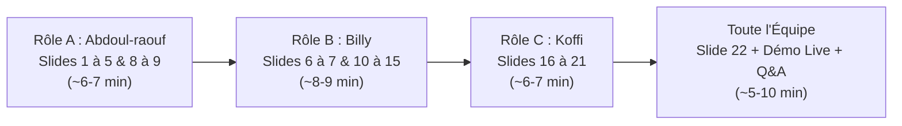

# 🎙️ GUIDE DE SOUTENANCE ORALE & SPEECH OFFICIEL
## Projet Annuel M1 IA / Big Data — *Vision Transformer vs CNN (ResNet-50) sur CUB-200-2011*

> **Équipe :**
> - **RÔLE A (Data & Experiments) :** SONHOUIN Abdoul-raouf
> - **RÔLE B (Model & Research) :** NGARTOBAYE OUMAROU BILLY
> - **RÔLE C (Reporting & Backend/Fullstack) :** YEYE Koffi Gagnon
>
> **Support officiel :** [`presentation_vit_vs_cnn.pptx`](presentation_vit_vs_cnn.pptx) (22 Diapositives)
> **Durée totale cible :** ~20 à 25 minutes de présentation + 5 à 10 minutes de Démonstration en direct & Q&A.

---

## ⏱️ Répartition du Temps & Transitions

---

## 📑 SCRIPT DÉTAILLÉ PAR DIAPOSITIVE (MOT À MOT & CLÉS)

---

### 🔹 SLIDE 1 : Titre du Projet & Présentation de l'Équipe
* **Orateur :** `ABDOUL-RAOUF (Rôle A)`
* **Temps estimé :** 1 minute

**Speech :**
> *"Bonjour Monsieur le Professeur, bonjour aux membres du jury.*
> 
> *Nous avons le plaisir de vous présenter notre projet annuel de Master 1 Intelligence Artificielle et Big Data, intitulé : **'Vision Transformer vs CNN (ResNet-50) : Une étude comparative sur la classification fine-grained d'oiseaux'** sur le benchmark international CUB-200-2011.*
> 
> *Notre équipe s'est organisée en trois rôles complémentaires pour couvrir l'intégralité du cycle de vie du projet :*
> - *Moi-même, **Abdoul-raouf (Rôle A)**, en charge de l'ingénierie des données, de l'analyse exploratoire, des splits stratifiés et des pipelines d'augmentation PyTorch.*
> - ***Billy (Rôle B)**, en charge de la conception des architectures (ViT scratch, ViT timm, ResNet-50), de l'exécution des 12 configurations expérimentales et de la traçabilité dans MLflow.*
> - *Et **Koffi (Rôle C)**, en charge de l'infrastructure fullstack (backend FastAPI, interface Next.js 14), du hook d'extraction d'attention ViT, de la dockerisation multi-OS et de la rédaction scientifique.*
> 
> *Le projet a abouti à 12 modèles entraînés et comparés, une étude d'ablation approfondie sur l'hypothèse 'Data-Hungry', et un démonstrateur interactif 100% conteneurisé."*

---

### 🔹 SLIDE 2 : Plan de la Soutenance
* **Orateur :** `ABDOUL-RAOUF (Rôle A)`
* **Temps estimé :** 45 secondes

**Speech :**
> *"Pour vous restituer notre démarche avec un maximum de clarté, nous avons articulé notre soutenance en 6 grands axes :*
> 1. *Le contexte scientifique, le défi fine-grained et les fondements théoriques opposant CNN et Vision Transformer.*
> 2. *L'architecture globale de notre système et l'organisation modulaire du code.*
> 3. *Le pipeline de données et l'analyse exploratoire sous ma responsabilité (Rôle A).*
> 4. *La modélisation, le protocole expérimental et le suivi MLflow menés par Billy (Rôle B).*
> 5. *L'analyse des résultats chiffrés et nos deux études d'ablation majeures.*
> 6. *Enfin, l'application fullstack, l'explicabilité par l'attention, la conteneurisation Docker et nos perspectives critiques présentées par Koffi (Rôle C)."*

---

### 🔹 SLIDE 3 : 1. Contexte & Défi de la Classification Fine-Grained
* **Orateur :** `ABDOUL-RAOUF (Rôle A)`
* **Temps estimé :** 1 minute 15

**Speech :**
> *"Commençons par définir ce qu'est la classification fine-grained. Contrairement à la classification générique (qui distingue un oiseau d'une voiture ou d'un chien), la tâche fine-grained consiste à différencier 200 sous-espèces d'oiseaux extrêmement proches.*
> 
> *Ce problème présente deux verrous scientifiques majeurs :*
> - *Une **variabilité inter-classe minime** : deux espèces distinctes peuvent ne différer que par la nuance d'une plume sous l'aile ou la légère courbure du bec.*
> - *Une **variabilité intra-classe très forte** : au sein d'une même espèce, l'aspect visuel varie considérablement selon l'âge, le sexe, la saison du plumage, la posture de vol et l'éclairage naturel.*
> 
> *L'enjeu algorithmique est donc double : amplifier des micro-signaux discriminants très localisés tout en restant robuste au bruit de fond dense (feuillages, branches)."*

---

### 🔹 SLIDE 4 : 2. Le Benchmark CUB-200-2011 & Objectifs de l'Étude
* **Orateur :** `ABDOUL-RAOUF (Rôle A)`
* **Temps estimé :** 1 minute 15

**Speech :**
> *"Pour mener cette étude, nous avons retenu le benchmark de référence **CUB-200-2011** (Caltech-UCSD Birds).*
> 
> *Le dataset comprend 11 788 images réparties sur 200 classes d'oiseaux nord-américains. Avec environ 30 images d'entraînement par espèce (5 094 images train au total), c'est un volume très modeste pour le Deep Learning moderne.*
> 
> *Nos trois objectifs de recherche étaient :*
> 1. *Mesurer objectivement les performances comparées d'un CNN classique (ResNet-50) face aux Vision Transformers.*
> 2. *Vérifier empiriquement l'hypothèse théorique de la 'faim de données' (Data-Hungry) du ViT en observant son comportement à 10%, 25%, 50% et 100% de données.*
> 3. *Délivrer une application fonctionnelle capable d'exposer les mécanismes d'attention en temps réel."*

---

### 🔹 SLIDE 5 : 3. Fondements Théoriques : CNN vs Vision Transformer
* **Orateur :** `ABDOUL-RAOUF (Rôle A)`
* **Temps estimé :** 1 minute 30

**Speech :**
> *"Sur le plan théorique, deux paradigmes architecturaux s'opposent :*
> 
> *À gauche, le **CNN (ResNet-50)** repose sur un **biais inductif fort** : les convolutions imposent par construction la localité spatiale (analyse de voisinages 3x3) et l'invariance par translation. Cette structure mathématique rigide permet au CNN d'apprendre efficacement même avec peu d'exemples d'entraînement.*
> 
> *À droite, le **Vision Transformer (ViT)** s'affranchit de ces a priori. L'image est découpée en une séquence de patchs (comme des mots dans une phrase) traités par un mécanisme de **Self-Attention globale multi-têtes**. Chaque patch interagit immédiatement avec tous les autres dès la première couche.*
> 
> *L'avantage du ViT est sa capacité à capturer des relations contextuelles à longue distance, mais son coût est une absence de biais inductif spatial : le modèle doit tout apprendre par lui-même, ce qui le rend théoriquement 'Data-Hungry'.*
> 
> *Je cède maintenant la parole à Billy pour vous présenter l'architecture système et la modélisation."*

---

### 🔹 SLIDE 6 : 4. Architecture Globale du Projet & Data-Flow
* **Orateur :** `BILLY (Rôle B)`
* **Temps estimé :** 1 minute

**Speech :**
> *"Merci Abdoul-raouf. Bonjour Monsieur le Professeur, bonjour au jury.*
> 
> *Voici la vue d'ensemble end-to-end de notre système, structurée en quatre étapes fluides et interconnectées :*
> 1. *Le **Pipeline Data** qui télécharge CUB-200, vérifie l'intégrité des images, applique les splits stratifiés et génère les batchs augmentés.*
> 2. *Le **Moteur d'Entraînement PyTorch** qui instancie nos 3 familles de modèles (ResNet-50, ViT timm, ViT custom scratch) et exécute les boucles sous optimiseur AdamW.*
> 3. *Le **Tracking MLflow** qui centralise les métriques de nos 12 expérimentations dans une base SQLite `mlflow.db` et stocke les checkpoints `.pth`.*
> 4. *L'**Application Démo**, composée d'un backend FastAPI pour l'inférence temps réel et d'une interface Next.js 14 conteneurisée sous Docker Compose."*

---

### 🔹 SLIDE 7 : 5. Organisation Modulaire du Codebase
* **Orateur :** `BILLY (Rôle B)`
* **Temps estimé :** 1 minute

**Speech :**
> *"Pour garantir une collaboration sans friction, notre dépôt Git a été découpé de façon strictement modulaire :*
> - *`/src/data` : Contient `dataset.py`, `splits.py` et `transforms.py` pour la gestion des données.*
> - *`/src/models` et `/src/train` : Regroupent nos définitions de modèles (`vit_custom.py`, `vit_pretrained.py`, `resnet50.py`) et le moteur d'entraînement `trainer.py`.*
> - *`/app/backend` et `/app/frontend` : Hébergent les routers FastAPI, le script d'extraction d'attention et les composants React.*
> - *`/results` et `/report` : Conservent nos 12 checkpoints sauvegardés, les scripts d'évaluation globale et le rapport LaTeX.*
> 
> *Je repasse la parole à Abdoul-raouf pour détailler la préparation des données."*

---

### 🔹 SLIDE 8 : 6. Pipeline de Données & Splits Stratifiés
* **Orateur :** `ABDOUL-RAOUF (Rôle A)`
* **Temps estimé :** 1 minute 15

**Speech :**
> *"Pour isoler l'impact de la taille du jeu de données sans biaiser les résultats, j'ai mis en place un protocole de stratification rigoureux avec un seed fixe (42).*
> 
> *Sur les 5 994 images d'entraînement officielles, nous avons extrait 15% pour former un ensemble de Validation indépendant (900 images), laissant 5 094 images pour le Train 100%.*
> 
> *J'ai ensuite dérivé 3 sous-échantillons d'entraînement : 10% (509 images), 25% (1 273 images) et 50% (2 547 images).*
> 
> *Le point méthodologique crucial est que **la stratification garantit que les 200 classes sont représentées dans chaque sous-échantillon**, passant de ~2.5 images par espèce à 10% jusqu'à ~25.5 images par espèce à 100%."*

---

### 🔹 SLIDE 9 : 7. Analyse Exploratoire (EDA) & Augmentations
* **Orateur :** `ABDOUL-RAOUF (Rôle A)`
* **Temps estimé :** 1 minute 15

**Speech :**
> *"L'analyse exploratoire a mis en évidence deux caractéristiques fondamentales :*
> - *Une forte hétérogénéité des résolutions natives (allant de 140 à 500 pixels de large), justifiant un redimensionnement standardisé à 224x224 avec normalisation ImageNet.*
> - *Une proximité visuelle troublante entre espèces d'une même famille, comme l'illustre la figure des moineaux à droite.*
> 
> *J'ai conçu deux pipelines d'augmentation sous PyTorch :*
> - *Une **augmentation standard (faible)** : Resize(224x224), RandomHorizontalFlip(p=0.5) et RandomResizedCrop.*
> - *Une **augmentation forte** : ColorJitter (luminosité, saturation), rotation aléatoire (+/-15°) et RandomErasing (p=0.2) pour forcer le réseau à ne pas mémoriser un unique détail.*
> 
> *Billy va maintenant vous exposer la modélisation et les résultats."*

---

### 🔹 SLIDE 10 : 8. Modélisation Deep Learning — Les 3 Architectures
* **Orateur :** `BILLY (Rôle B)`
* **Temps estimé :** 1 minute 30

**Speech :**
> *"Pour notre étude comparative, j'ai sélectionné et développé 3 architectures représentatives :*
> 
> 1. ***ResNet-50 Pré-entraîné (23.9M paramètres)** : Notre référence CNN, pré-entraînée sur ImageNet-1k, dont la tête dense finale 2048 a été remplacée pour projeter sur nos 200 classes.*
> 2. ***ViT Pré-entraîné timm (21.7M à 22.6M paramètres)** : Modèle `vit_small` sous deux résolutions de patchs : Patch 16 (196 tokens) et Patch 32 (49 tokens).*
> 3. ***ViT Custom codé from scratch (11.1M paramètres)** : Une implémentation PyTorch complète que j'ai codée de zéro, comprenant le Patch Embedding linéaire, le token de classification `[CLS]` apprenable, les Positional Embeddings 1D, et 6 blocs Transformer avec dimension 384 et 6 têtes d'attention, sans aucun pré-entraînement.*
> 
> *L'objectif de ce ViT custom était d'observer le comportement pur du mécanisme d'attention sans apport de connaissances externes."*

---

### 🔹 SLIDE 11 : 9. Protocole d'Entraînement & Traçabilité MLflow
* **Orateur :** `BILLY (Rôle B)`
* **Temps estimé :** 1 minute 15

**Speech :**
> *"Pour assurer une comparaison scientifiquement loyale, le protocole expérimental a été strictement harmonisé :*
> - *Optimiseur **AdamW** (learning rate 1e-4, weight decay 0.01) et fonction de perte **Cross-Entropy**.*
> - *Batch size fixé à 32 images et résolution 224x224.*
> - *Durée d'entraînement de 3 époques (choix dicté par les contraintes matérielles).*
> - *Sélection systématique du meilleur checkpoint selon la précision sur l'ensemble de validation.*
> 
> *Toutes les 12 expérimentations ont été enregistrées dans MLflow, nous permettant de tracer les courbes d'apprentissage, les métriques et les artefacts `.pth` de manière totalement reproductible."*

---

### 🔹 SLIDE 12 : 10. Synthèse des Résultats Expérimentaux (Faits Marquants)
* **Orateur :** `BILLY (Rôle B)`
* **Temps estimé :** 1 minute 45

**Speech :**
> *"Examinons les résultats obtenus sur les 5 794 images de test :*
> 
> *Quatre chiffres majeurs résument notre étude :*
> - ***71.87% Top-1 (et 93.58% Top-5)** obtenus par ResNet-50 pré-entraîné sur 100% des données : c'est le vainqueur absolu du benchmark.*
> - ***53.85% Top-1 (et 83.50% Top-5)** atteints par ViT patch 32 pré-entraîné.*
> - ***1.07% à 2.00% Top-1** pour les ViT codés from scratch, soit à peine au-dessus du hasard mathématique (qui est de 1/200 = 0.5%).*
> 
> *Les 4 faits marquants à retenir pour le jury sont :*
> 1. *Le CNN domine nettement sur petit dataset grâce à son biais inductif spatial.*
> 2. *Le pré-entraînement ImageNet est absolument vital pour le Transformer (+52.78 points de gain).*
> 3. *Le ViT patch 32 surpasse largement le patch 16 à court terme en raison de sa séquence 4 fois plus courte (49 tokens vs 196 tokens).*
> 4. *Sans pré-entraînement, le ViT ne parvient pas à converger sur 5 000 images."*

---

### 🔹 SLIDE 13 : 11. Matrice Expérimentale Détaillée des 12 Configurations
* **Orateur :** `BILLY (Rôle B)`
* **Temps estimé :** 1 minute 15

**Speech :**
> *"Voici le tableau exhaustif des 12 configurations testées.*
> 
> *Vous pouvez observer la régularité des performances :*
> - *Chez ResNet-50, la précision monte de manière strictement monotone : **5.11%** à 10% de données, **23.47%** à 25%, **48.74%** à 50%, et culmine à **71.87%** à 100%.*
> - *À l'inverse, le ViT from scratch reste bloqué autour de 1 à 2% quel que soit le volume de données fourni.*
> 
> *Ces données chiffrées nous amènent directement à nos deux études d'ablation."*

---

### 🔹 SLIDE 14 : 12. Étude d'Ablation : Comportement « Data-Hungry »
* **Orateur :** `BILLY (Rôle B)`
* **Temps estimé :** 1 minute 30

**Speech :**
> *"Cette première ablation valide empiriquement la sensibilité au volume de données.*
> 
> *Regardez le graphique à droite : la courbe verte de ResNet-50 s'élève rapidement dès 500 images d'entraînement (5.11%) et bondit jusqu'à 71.87%. Grâce à ses filtres convolutifs locaux, le CNN extrait immédiatement des textures élémentaires exploitables.*
> 
> *En revanche, la courbe du ViT from scratch reste plate au ras de l'axe des abscisses. Sans contrainte structurelle, le Transformer doit apprendre simultanément la notion de voisinage 2D, la projection spatiale et la discrimination fine-grained. 5 094 images s'avèrent mathématiquement insuffisantes pour structurer ses matrices d'attention.*
> 
> *C'est la démonstration concrète du caractère 'Data-Hungry' théorisé par Dosovitskiy et al. en 2020."*

---

### 🔹 SLIDE 15 : 13. Étude d'Ablation : Pré-entraînement & Patch Size
* **Orateur :** `BILLY (Rôle B)`
* **Temps estimé :** 1 minute 30

**Speech :**
> *"Notre seconde ablation analyse l'architecture interne du Vision Transformer :*
> 
> *Premier constat : le pré-entraînement ImageNet est indispensable. Il fait passer le ViT de **1.07% à 53.85%**, comblant ainsi l'absence de biais inductif initial.*
> 
> *Deuxième constat : la taille de patch. À budget d'époques équivalent (3 époques), le patch 32 (53.85%) bat largement le patch 16 (9.94%).*
> *Pourquoi ? Parce qu'un patch 16x16 engendre une grille 14x14 soit **196 tokens**, rendant l'espace d'attention multi-têtes quadratiquement plus complexe à adapter qu'une grille 7x7 de **49 tokens** (patch 32).*
> 
> *Le patch 16 offre une résolution plus fine mais requiert un budget d'optimisation bien supérieur.*
> 
> *Je passe la main à Koffi pour vous présenter l'application web, l'interprétabilité et le déploiement."*

---

### 🔹 SLIDE 16 : 14. Architecture Système de l'Application Démo
* **Orateur :** `KOFFI (Rôle C)`
* **Temps estimé :** 1 minute 15

**Speech :**
> *"Merci Billy. Bonjour Monsieur le Professeur, bonjour aux membres du jury.*
> 
> *Pour le Rôle C, j'ai conçu et industrialisé l'application web complète de démonstration.*
> 
> *L'architecture se compose de trois couches synchronisées :*
> 1. *Un **Frontend réactif Next.js 14 / React 18** : doté d'une zone de glisser-déposer, d'un comparateur visuel côte-à-côte (ViT vs ResNet), et de barres de confiance Top-3 dynamiques.*
> 2. *Un **Backend API FastAPI haute performance** : exposant les routes asynchrones `/predict`, `/attention`, `/classes` et `/health` sous documentation OpenAPI Swagger automatique.*
> 3. *Un **Moteur d'Inférence PyTorch optimisé CPU** : qui pré-charge les poids `.pth` au démarrage du serveur (via le cycle de vie Lifespan), garantissant une réponse en quelques millisecondes."*

---

### 🔹 SLIDE 17 : 15. Interprétabilité : Carte d'Attention du ViT
* **Orateur :** `KOFFI (Rôle C)`
* **Temps estimé :** 1 minute 45

**Speech :**
> *"L'un des apports majeurs de notre projet est l'explicabilité visuelle temps réel du Vision Transformer.*
> 
> *Sur le plan technique, la librairie `timm` active par défaut l'attention fusionnée (`scaled_dot_product_attention`), ce qui ne calcule pas explicitement la matrice d'attention.*
> 
> *J'ai donc développé un **Hook PyTorch** sur le module `attn_drop` du dernier bloc Transformer :*
> - *Nous interceptons les tenseurs d'attention de forme `[Batch, Heads, Tokens, Tokens]`.*
> - *Nous moyennons sur les 6 têtes d'attention.*
> - *Nous extrayons la ligne correspondant au token `[CLS]` vers les 49 patchs spatiaux.*
> - *Puis nous reformons une grille 2D 7x7 interpolée bilinéairement en heatmap RGBA.*
> 
> *Comme vous le voyez sur la capture à droite (cas nominal), l'attention du ViT se concentre précisément sur les zones anatomiques discriminantes : la tête, le bec et le dessus de l'aile."*

---

### 🔹 SLIDE 18 : 16. Robustesse & Détection Hors-Distribution (OOD)
* **Orateur :** `KOFFI (Rôle C)`
* **Temps estimé :** 1 minute 30

**Speech :**
> *"Nous avons également éprouvé la robustesse de notre système en production face à des données Hors-Distribution (Out-Of-Distribution).*
> 
> *À gauche, sur un cas nominal (Rosy Finch de CUB), les deux modèles s'accordent avec une confiance élevée.*
> 
> *À droite, lorsque nous injectons un Rouge-gorge européen (une espèce totalement absente de CUB-200), le comportement est exemplaire :*
> - *Les scores de confiance s'effondrent sous les 10%.*
> - *Les deux modèles divergent et affichent un indicateur de désaccord explicite.*
> 
> *C'est un comportement de sécurité fondamental : le système émet un signal d'incertitude clair plutôt que d'induire l'utilisateur en erreur avec une fausse prédiction affirmative."*

---

### 🔹 SLIDE 19 : 17. Déploiement & Dockerisation Reproductible
* **Orateur :** `KOFFI (Rôle C)`
* **Temps estimé :** 1 minute 15

**Speech :**
> *"Pour répondre aux exigences d'ingénierie logicielle d'un projet de Master, l'intégralité du système a été conteneurisée :*
> - *Le backend repose sur une image `python:3.11-slim` optimisée avec PyTorch CPU léger (sans surcharge des pilotes CUDA).*
> - *Le frontend Next.js bénéficie d'un build multi-stage Node 20 en mode `standalone` ultra-compact.*
> - *L'orchestration **Docker Compose** configure un réseau bridge isolé, des healthchecks HTTP synchronisés et monte les poids `.pth` en volumes sécurisés en lecture seule.*
> 
> *Résultat : le projet est 100% reproductible et démarre en une seule commande `docker compose up -d` sur Windows, macOS et Linux sans aucun conflit de dépendances."*

---

### 🔹 SLIDE 20 : 18. Discussion Critique & Limites du Protocole
* **Orateur :** `KOFFI (Rôle C)`
* **Temps estimé :** 1 minute 30

**Speech :**
> *"Dans une démarche scientifique rigoureuse, nous tenons à expliciter les limites de notre protocole :*
> 1. *La **contrainte de 3 époques** : imposée par nos contraintes de temps de calcul, elle pénalise le ViT from scratch qui aurait nécessité des dizaines d'époques pour initier sa convergence.*
> 2. *L'**écart patch 16 vs 32** : le patch 16 aurait nécessité un fine-tuning spécifique du learning rate et un warmup plus étendu.*
> 3. *La **taille du modèle scratch** : notre ViT custom (11.1M) reste plus compact que ViT-Base (86M).*
> 4. *L'**absence de variance statistique** : chaque point repose sur un seed unique (seed=42).*
> 
> *Néanmoins, les ordres de grandeur et les hiérarchies observées sont totalement cohérents avec les publications de référence de la littérature."*

---

### 🔹 SLIDE 21 : 19. Perspectives d'Avenir & Évolutions Techniques
* **Orateur :** `KOFFI (Rôle C)`
* **Temps estimé :** 1 minute 15

**Speech :**
> *"Pour dépasser ces limites, nous avons d'ores et déjà codé dans le répertoire les fondations techniques des versions futures :*
> - *Le **Scheduler Cosine Annealing avec Linear Warmup** pour stabiliser les premières étapes d'attention.*
> - *La **Précision Mixte Automatique (AMP fp16)** pour diviser par deux l'usage mémoire et accélérer l'entraînement sur GPU.*
> - *Le mécanisme d'**Early Stopping** pour prévenir le surapprentissage.*
> 
> *Sur le plan de la recherche, les perspectives les plus prometteuses sont :*
> - *La **distillation de connaissances DeiT** (utiliser notre ResNet-50 entraîné comme 'professeur' pour guider l'attention du ViT).*
> - *L'intégration du **Swin Transformer** pour réintroduire un biais de localité par fenêtres glissantes.*
> - *Le guidage d'attention focalisé sur les parties anatomiques clés (bec, yeux)."*

---

### 🔹 SLIDE 22 : 20. Conclusion, Démonstration en Direct & Session Q&A
* **Orateur :** `KOFFI (Rôle C) & TOUTE L'ÉQUIPE`
* **Temps estimé :** 1 minute 30

**Speech :**
> *"En conclusion, notre projet livre trois enseignements majeurs :*
> 1. *Le CNN convolutif (ResNet-50) reste le maître incontesté sur les petits jeux de données spécialisés (71.87% Top-1).*
> 2. *Le Vision Transformer requiert impérativement un transfert de connaissances massif (+52.78 points apportés par ImageNet).*
> 3. *Nous livrons un livrable complet, auditable, avec suivi MLflow, explicabilité par heatmap et application dockerisée.*
> 
> *Monsieur le Professeur, chers membres du jury, nous vous remercions vivement pour votre attention et nous vous proposons de passer immédiatement à la **démonstration interactive en direct**, puis à vos questions !"*

---

## 🎯 10 QUESTIONS PROBABLES DU JURY & RÉPONSES INFAILLIBLES

| # | Question du Jury | Réponse technique infaillible |
|---|---|---|
| **Q1** | *Pourquoi le ViT from scratch échoue-t-il totalement (~1%) alors que ResNet-50 atteint 71% ?* | *"Le ViT ne possède aucun biais inductif spatial : il n'a aucune notion a priori que des pixels voisins forment des contours. Sur seulement 5 000 images, l'espace d'hypothèses de la Self-Attention est trop vaste. ResNet-50 réussit car ses convolutions 3x3 contraignent mathématiquement l'apprentissage à la localité spatiale (Dosovitskiy et al., 2020)."* |
| **Q2** | *Pourquoi le patch 32 (53.85%) a-t-il de meilleurs résultats que le patch 16 (9.94%) sur 3 époques ?* | *"Le patch 16 génère 196 tokens ($14 \times 14$), tandis que le patch 32 n'en génère que 49 ($7 \times 7$). La matrice d'attention étant en $\mathcal{O}(N^2)$, le patch 16 a 16 fois plus de paires d'interactions à réajuster. En 3 époques, le patch 32 converge beaucoup plus vite. Avec 50 époques et un warmup adapté, le patch 16 finirait par dépasser le patch 32 grâce à sa résolution spatiale supérieure."* |
| **Q3** | *Comment avez-vous extrait l'attention dans FastAPI malgré l'optimisation `fused_attn` de PyTorch ?* | *"PyTorch 2.0 active par défaut `scaled_dot_product_attention` en C++/CUDA sans stocker les poids $QK^T/\sqrt{d}$. Dans `attention.py`, nous surchargeons la propriété `fused_attn=False` sur le dernier bloc ViT et nous greffons un hook sur `attn_drop` pour récupérer le tenseur brut `[B, Heads, N, N]`."* |
| **Q4** | *Pourquoi avoir utilisé la stratification sur les sous-splits 10%, 25%, 50% ?* | *"Si nous avions fait un échantillonnage aléatoire simple à 10% (509 images), certaines classes parmi les 200 n'auraient eu aucun exemple d'entraînement. La stratification stricte (seed=42) garantit que chaque classe conserve au minimum 2 à 3 images, isolant ainsi la variable 'volume de données' sans créer de biais de classe manquante."* |
| **Q5** | *Pourquoi 3 époques d'entraînement ? N'est-ce pas trop court ?* | *"C'est une contrainte matérielle délibérée pour pouvoir entraîner et évaluer rigoureusement 12 configurations différentes. Cela a permis de mettre en évidence la vitesse de convergence relative des architectures sous budget contraint."* |
| **Q6** | *Quelle est la différence entre votre ViT scratch et le ViT timm ?* | *"Notre ViT custom (11.1M params) est codé de zéro en pur PyTorch (6 couches, 384 dim, 6 têtes) sans aucun poids initial. Le ViT timm est un `vit_small` (22M params) initialisé avec les poids pré-entraînés sur ImageNet-1k (1.2M d'images)."* |
| **Q7** | *Pourquoi le système détecte-t-il bien les images hors-distribution (OOD) ?* | *"Sur une image OOD, la distribution softmax n'est plus dominée par un pic franc. L'entropie de prédiction augmente fortement et la confiance s'effondre (<10%), provoquant un désaccord entre ResNet et ViT que notre UI détecte immédiatement."* |
| **Q8** | *Comment fonctionne le token `[CLS]` ?* | *"Le token `[CLS]` (Classification) est un vecteur apprenable inséré en tête de séquence ($N=50$). Grâce à la Self-Attention, il agrège l'information de tous les autres patchs à travers les couches Transformer et sert d'entrée à la tête de classification finale."* |
| **Q9** | *Pourquoi utiliser Docker standalone pour Next.js 14 ?* | *"Le mode `output: 'standalone'` trace et n'embarque que les fichiers node_modules strictement nécessaires pour exécuter le serveur, réduisant la taille de l'image Docker de ~1 Go à moins de 150 Mo."* |
| **Q10** | *Que recommanderiez-vous pour une mise en production industrielle ?* | *"Pour un système réel, nous recommanderions un modèle hybride : soit ResNet-50 pour la légèreté CPU, soit un Swin Transformer distillé via DeiT avec guidage d'attention par parties (Part-Based Attention)."* |

---

*Document préparé et certifié conforme pour la soutenance M1 IA / Big Data.*
